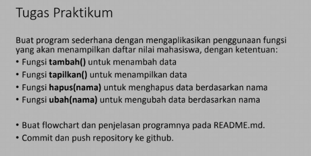
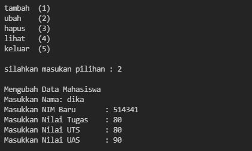

# **PERTEMUAN 11**
# **Latihan**
pada latihan 11 saya diberi soal


## jawab
nomor 1 :
> before
```py
def a(x):
    return x**2
```
> after 
```py
a=lambda x: (x**2)
```
nomor 2 :
> before
```py
def b(x,y):
    return math.sqrt(x**2 + y**2)
```
> after
```py
b=lambda x,y: math.sqrt(x**2 + y**2)
```
nomor 3
> before
```py
def c(*args):
    return sum(args)/len(args)
```
> after
```py
c=lambda *args:sum(args)/len(args)
```

nomor 4:
> before
```py
def d(s):
    return "".join(set(s))
```
> after
```py
d=lambda s: "".join(set(s))
```


# **Praktikum**
pada tugas praktium saya diberi soal sebagai berikut
 

## JAWAB
pertama saya membuat looping agar program terus berjalan
```py
while True:
    print('\ntambah\t(1)\nubah\t(2)\nhapus\t(3)\nlihat\t(4)\nkeluar\t(5) ')                                                                                     
    c = input("\nsilahkan masukan pilihan : ")                              
```
lalu saya membuat function untuk memasukan pilihan ,
sebagai contoh apabila memilih (1) akan menambah data
```py
def tambah():
    print('\nTambah Data Mahasiswa')
    nama= input("Masukkan Nama\t\t: ")                                        
    nim= input("Masukkan NIM\t\t: ")                                         
    nilaiTugas= int(input("Masukkan Nilai Tugas\t: "))                              
    nilaiUts= int(input("Masukkan Nilai UTS\t: "))                                   
    nilaiUas= int(input("Masukkan Nilai UAS\t: "))                                    
    nilaiAkhir= (0.30 * nilaiTugas) + (0.35 * nilaiUts) + (0.35 * nilaiUas)
    dt[nama]=nim,nilaiTugas,nilaiUts,nilaiUas,nilaiAkhir,
```
saya juga menambahkan function lain untuk melaksanakan pilihan yang lain
sebagai contoh apabila saya memilih (2) akan mengubah data
```py
def ubah():
    print('\nMengubah Data Mahasiswa')
    nama = input("Masukkan Nama: ")                                                         
    if nama in dt.keys():                              
        nim= input("Masukkan NIM Baru\t: ")                              
        nilaiTugas= int(input("Masukkan Nilai Tugas\t: "))                           
        nilaiUts= int(input("Masukkan Nilai UTS\t: "))                           
        nilaiUas= int(input("Masukkan Nilai UAS\t: "))                           
        nilaiAkhir= (0.30 * nilaiTugas) + (0.35 * nilaiUts) + (0.35 * nilaiUas)          
        dt[nama] = nim, nilaiTugas, nilaiUts, nilaiUas, nilaiAkhir                      
        print("\nData Berhasil Di Update!\n")
```
dan saya juga menggunakan else untuk mengakhiri program 
```py
else:
    keluar()
    break
                                                                                                           
```
## tampilan pada visual studio code


## output
ini adalah output apabila memilih tambah(1)


ini adalah output apabila memilih ubah(2)


ini adalah output apabila memilih untuk  tambah lagi


ini adalah output apabila memilih hapus(3)


ini adalah output apabila memilih lihat (4)


ini adalah output apabila memilih keluar (5)


======TERIMAKASIH======
